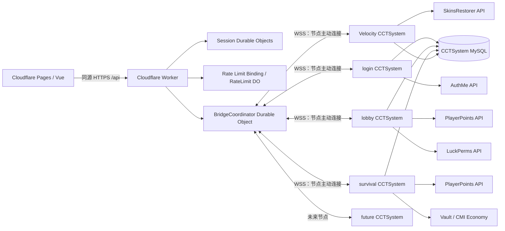
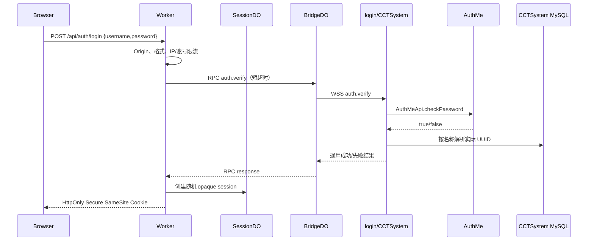
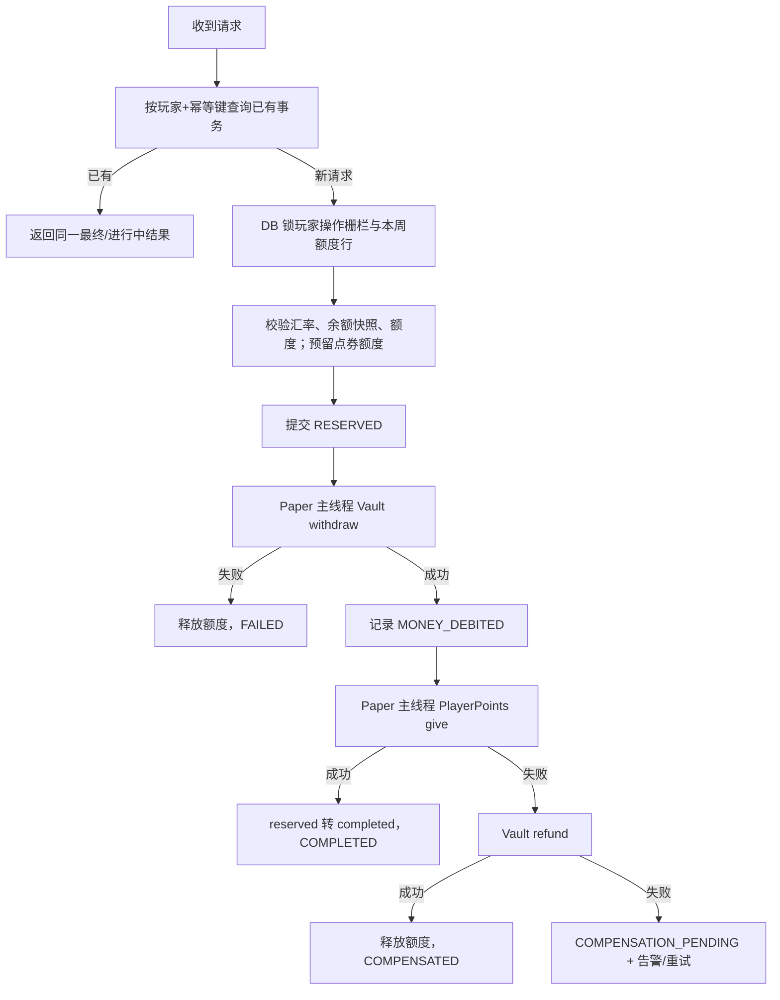

# CCTSystem 最终架构设计

> 状态：设计冻结候选稿（2026-08-14）
> 本文只确定边界、模块、数据模型与关键流程，不代表已经开始实现全部业务代码。

## 1. 结论与关键修正

1. `CCTSystem.jar` 保持单 JAR，但内部使用两个平台入口：Paper 读取 `plugin.yml` 并加载 `PaperBootstrap`，Velocity 读取 `velocity-plugin.json` 并加载 `VelocityBootstrap`。两个入口只负责适配平台生命周期，业务代码共享。
2. 功能启用不能只看“安装了某个依赖”。实际服务器中 login 也安装了 Vault，且已经存在多个额外实例。最终判定必须同时满足：`platform + 显式 server-id/role + 配置开关 + 依赖/Provider 可用`。
3. 每个需要承接 RPC 的 Minecraft 节点都直接主动连接 Cloudflare Durable Object。不能把所有请求先发到 Velocity 再用插件消息转发，因为插件消息依赖在线玩家，不适合官网登录等无人在线时也必须工作的请求。
4. Velocity 仍是全网在线状态、玩家所在子服和 SkinsRestorer 的权威节点；login 是 AuthMe 权威节点；lobby 默认是会员、点券读取、兑换码等全局业务的 mutation authority；survival 是当前 Vault 金币兑换权威节点。
5. AuthMe 当前没有配置 UUID 数据列。CCTSystem 必须在玩家真实登录时记录 Velocity/Paper 实际 UUID，并维护用户名历史。官网登录先由 AuthMe 校验用户名和密码，再从 CCTSystem 身份表解析 UUID；前端响应不返回 UUID。
6. PlayerPoints 和 Vault 都是外部、非事务型 API。MySQL、Vault、PlayerPoints 三者无法形成真正的分布式原子事务。系统实现的是“幂等 + 配额预留 + Saga 补偿 + 异常人工对账”，不能虚假承诺跨三套系统的绝对 exactly-once。
7. 每周额度不做物理“清零”。以 `Asia/Shanghai` 计算周一日期并创建新的周桶，历史周数据永久保留。
8. 会员固定一个月等于 30×24 小时，而不是自然月。官网与游戏统一显示“30 天”。
9. 后文采用最新的菜单要求：兑换按钮为 1、10、100 点券，替代需求前部出现的 1、10、50、最大额度版本。
10. 内部等级键使用 `vip`、`vip_plus`、`mvp`、`mvp_plus`，展示名才是 `VIP`、`VIP+`、`MVP`、`MVP+`，不使用 `VIPP`。
11. 当前模板包名 `cn.cctstudio.cCTSystem` 的大小写不符合常规 Java package 规范；实现阶段统一迁移到全小写 `cn.cctstudio.cctsystem`。

## 2. 已核对的现状基线

- Paper：1.21.11，Java 21。
- Velocity：3.5.0-SNAPSHOT；实现时以稳定 Velocity API 兼容面为基线，并对当前构建做实际冒烟测试。
- AuthMe：6.0.0，位于 login 的 Paper 端，同时 Velocity 已安装配套代理插件。
- PlayerPoints：3.3.5，lobby 与 survival 使用同一 MySQL 数据源。
- LuckPerms：5.5 API，全部节点使用 MySQL，`messaging-service: auto` 在当前 SQL 存储下会使用 SQL 消息同步。
- SkinsRestorer：15.12.4，只位于 Velocity；其 API 标注仍可能发生变更，所以必须隔离在独立 adapter 中。
- survival 的 Vault economy provider：CMI Economy。
- 官网：Vue 3 + Vite；现有风格为暖色编辑感，正文 `Inter Variable`、标题 `Newsreader Variable`、会员标签 `Monocraft`。
- Worker 目录当前为空，适合按本设计直接初始化 TypeScript Workers 项目。

## 3. 总体拓扑



Worker 只做边缘安全、会话、校验、限流和 RPC 路由；所有会改变 Minecraft 业务状态的请求，仍由 CCTSystem Service 再次校验并最终决定。

## 4. 三个项目的边界

### 4.1 `~/CCTSystem/CCTSystem`

Gradle 多模块工程，最终只产出一个可分发 JAR：

```text
CCTSystem
├── cctsystem-contract          # RPC DTO、错误码、版本
├── cctsystem-core              # 生命周期、配置、模块注册、调度抽象
├── cctsystem-storage-mysql     # HikariCP、Repository、迁移、事务
├── cctsystem-domain-identity
├── cctsystem-domain-points
├── cctsystem-domain-exchange
├── cctsystem-domain-membership
├── cctsystem-domain-redeem
├── cctsystem-domain-promotion
├── cctsystem-domain-audit
├── cctsystem-bridge
├── cctsystem-platform-paper
├── cctsystem-platform-velocity
├── cctsystem-integration-authme
├── cctsystem-integration-playerpoints
├── cctsystem-integration-vault
├── cctsystem-integration-luckperms
├── cctsystem-integration-skinsrestorer
└── cctsystem-distribution      # Shadow JAR、relocation、双入口描述文件
```

初期如果不希望 Gradle 子工程过多，可以保留相同 package 边界并合并部分构建模块；依赖方向仍必须保持为 `platform/integration -> domain/core`，domain 不能引用 Bukkit 或 Velocity 类。

### 4.2 `~/CCTSystem/CCTSystemAPI`

TypeScript Cloudflare Worker：

```text
src
├── index.ts
├── routes
│   ├── auth.ts
│   ├── me.ts
│   ├── catalog.ts
│   ├── exchange.ts
│   ├── redeem.ts
│   └── servers.ts
├── durable-objects
│   ├── BridgeCoordinator.ts
│   ├── SessionObject.ts
│   └── RateLimitObject.ts       # 仅在内置 binding 不够时使用
├── middleware
│   ├── session.ts
│   ├── csrf.ts
│   ├── origin.ts
│   ├── rate-limit.ts
│   └── validation.ts
├── rpc
│   ├── protocol.ts
│   └── bridge-client.ts
└── schemas
```

### 4.3 `~/CCTStudioWeb`

- 继续使用已有 Vue、router、design tokens、Header、Footer 和深浅色主题。
- 建议只新增一个 `/account` 页面：未登录时显示精简登录卡，登录后显示个人资料、头像、会员、点券、兑换和兑换码入口。`/login` 可以重定向到 `/account`，避免页面膨胀。
- `/rank` 的等级权益文案保持现有短文风格；价格、时长、折扣、可购买状态改为 API 数据。
- 所有请求使用同源 `/api` 和 `credentials: include`，不在 localStorage 保存 session 或 UUID。

## 5. 单 JAR 双平台实现

### 5.1 双入口

- Paper：`cn.cctstudio.cctsystem.platform.paper.PaperBootstrap extends JavaPlugin`
- Velocity：`cn.cctstudio.cctsystem.platform.velocity.VelocityBootstrap`，使用 Velocity 插件入口/注入。
- JAR 同时包含 `plugin.yml` 与 `velocity-plugin.json`。
- Paper API、Velocity API 和第三方插件 API 全部 `compileOnly`；HikariCP、MySQL driver、JSON 库、迁移库进入最终 JAR并 relocation，避免与其他插件冲突。
- 两个平台不会加载对方入口；共享 core 不得在类签名、静态字段或初始化路径中引用另一平台的类。

### 5.2 生命周期抽象

core 只认识以下接口：

```text
PlatformRuntime
├── platformType()
├── serverId()
├── nodeId()
├── mainThreadExecutor()
├── asyncExecutor()
├── commandRegistry()
├── playerDirectory()
└── pluginDiscovery()
```

Paper 主线程执行：Inventory、Player、Vault 变更、PlayerPoints 变更及 Bukkit 事件相关调用。数据库、AuthMe 密码校验、HTTP/WSS、图片和皮肤解析全部放到专用异步执行器。LuckPerms API 本身线程安全，但仍通过独立 provider executor 管理超时。

### 5.3 模块启用算法

每个模块声明：

```text
module id
supported platforms
accepted roles
required providers
optional providers
explicit config gate
exposed RPC capabilities
```

启动顺序：

1. 平台入口确定 `PAPER` 或 `VELOCITY`。
2. 加载并验证显式 `network-id/server-id/node-id/roles`。
3. 探测第三方插件并创建 Provider；不加载缺失插件的 adapter 类。
4. 根据角色与配置构建候选模块。
5. 对 required provider 做健康检查。
6. 模块以 `ENABLED / DEGRADED / DISABLED` 启动，并在日志中打印简洁原因。
7. Bridge 上报当前能力；Worker 只向具备对应 capability 的健康节点路由。

建议配置骨架：

```yaml
network-id: cct-main
server-id: survival
node-id: survival-1
roles:
  - gameplay
  - economy-source

database:
  jdbc-url: ${CCTSYSTEM_DB_URL}
  username: ${CCTSYSTEM_DB_USER}
  password: ${CCTSYSTEM_DB_PASSWORD}

bridge:
  enabled: true
  url: wss://api.cctstudio.cn/internal/minecraft/connect
  secret: ${CCTSYSTEM_BRIDGE_SECRET}

modules:
  exchange:
    enabled: true
    provider: vault
    source-id: survival_coins
  membership:
    enabled: true
  redeem:
    enabled: true
  skins:
    enabled: auto
```

`auto` 只能在 role 已允许时补充判断，不能因为发现 Vault 就擅自开启货币兑换。

### 5.4 当前角色建议

| 逻辑 server-id | 平台 | roles | 权威能力 |
|---|---|---|---|
| `velocity` | Velocity | `proxy`, `network-authority`, `skin-authority` | 在线状态、所在子服、皮肤、跨服事件 |
| `login` | Paper | `auth-authority` | AuthMe 密码验证、身份补录 |
| `lobby` | Paper | `business-authority`, `points-authority` | 点券读取/扣除、会员、兑换码、LP 投影 |
| `survival` | Paper | `gameplay`, `economy-source` | survival 金币、金币兑换、通用菜单 |

未来同类服务器增加副本时，用独立 `node-id`，例如逻辑 `lobby` 下的 `lobby-1/lobby-2`。mutation authority 必须唯一，或使用数据库租约选主；不能随机负载均衡写请求。

## 6. 核心 Service 与 Provider

### 6.1 Service

- `IdentityService`：UUID、当前用户名、历史名、展示资料。
- `AuthService`：只编排 AuthMe 校验和网站登录结果，不保存密码。
- `PointsService`：PlayerPoints 的唯一领域入口，附带 CCTSystem 自己的操作流水。
- `ExchangeService`：所有官网、菜单、命令、NPC、未来服务器兑换的唯一入口。
- `MembershipService`：购买、续期、暂停、恢复、折价、管理员操作。
- `MembershipPricingService`：基础价格、活动折扣、折价额度、最终价格快照。
- `PromotionService`：折扣创建、停止、有效窗口与倒计时信息。
- `RedeemCodeService`：认领、次数限制和奖励发放 Saga。
- `SkinService`：当前 SkinsRestorer 皮肤快照与头像素材。
- `NetworkStatusService`：Velocity 在线状态与子服状态。
- `AuditService`：统一审计写入。
- `OutboxService`：LP 同步、失败重试、补偿和未来奖励发放。

### 6.2 Provider

- `AuthProvider` -> AuthMe
- `PointsProvider` -> PlayerPoints
- `EconomyProvider` -> Vault/CMI
- `PermissionProvider` -> LuckPerms
- `SkinProvider` -> SkinsRestorer
- `PlatformPlayerProvider` -> Paper/Velocity 玩家对象

Provider 只负责第三方 API 适配和线程亲和性；规则全部在 Service，菜单和命令不得直接调用 Provider。

## 7. 身份与 AuthMe 官网登录

### 7.1 身份规则

- 数据库主键使用实际 Minecraft UUID 的 16 字节形式。
- 用户名归一化用于查找，原始大小写名称用于展示。
- `players` 在 Velocity 首次连接和 Paper 登录事件中 upsert。
- `player_name_history` 保存历史名称与首次/最后使用时间。
- 官网绝不返回 UUID。Session 内部保存 UUID，API DTO 仅返回名称、头像 URL、业务信息。

当前 AuthMe 未配置 UUID 列，因此旧玩家可能在 CCTSystem 上线前没有映射。迁移策略：

1. 优先匹配 CCTSystem 已记录的当前名/历史名。
2. 部署前从当前 LuckPerms、PlayerPoints 已知 UUID 与名称建立一次性映射候选。
3. 对仍未匹配的 AuthMe 账号，只有在可证明其实际离线 UUID 与当前代理算法一致时才自动补录；否则要求玩家先进入一次服务器。
4. 不把 `UUID.nameUUIDFromBytes("OfflinePlayer:" + username)` 当成永久通用真理，因为代理的 premium/UUID 策略未来可能变化。

### 7.2 登录流程



约束：

- Worker 和 Minecraft 两侧都不记录请求体或密码。
- 密码只在当前 HTTPS/WSS 请求内存中短暂存在。
- 登录失败统一返回“用户名或密码错误”，不暴露账号是否注册。
- Session 使用随机 opaque token，不使用不可撤销 JWT；Cookie 建议 `__Host-cct_session`，`HttpOnly; Secure; SameSite=Lax; Path=/`。
- 登录接口按 IP、用户名哈希双维度限流，连续失败进入渐进冷却；必要时接 Turnstile。
- 当前 AuthMe 使用 SHA256。正式开放网站登录前建议迁移到 BCRYPT/PBKDF2 或经压测后的 ARGON2，并将 SHA256 放入 legacy hash 迁移路径。

## 8. Worker、Durable Object 与 WSS 协议

### 8.1 Durable Object 划分

- `BridgeCoordinatorDO(network-id)`：接收各 Minecraft 节点 WSS，维护 `node-id -> capabilities/socket`，转发短生命周期 RPC。
- `SessionObject(session-id)`：持久化 session 的 UUID、创建时间、过期时间、最近使用时间和版本。
- 限流优先使用 Cloudflare Rate Limiting binding；需要账号级强一致计数时再使用 `RateLimitObject(key-hash)`。

Bridge 使用 WebSocket Hibernation API。节点元数据通过 `serializeAttachment` 保存，重要状态放 DO storage，不能假设 DO 内存永远存在。

### 8.2 双向鉴权与防重放

每个 node 使用独立 256-bit secret，不共享一个全网密钥。WSS upgrade 带：

```text
network-id
server-id
node-id
timestamp
nonce
body-hash
HMAC-SHA256 signature
```

DO 校验允许时间偏差、HMAC 和短期 nonce 去重；成功后为连接分配 `connection-id` 与随机 challenge。每个 frame 含单调 `sequence`、`request-id`、`deadline`、`operation`、`payload`，连接级 sequence 不允许回退或重复。旧连接用 boot-id/epoch fencing，避免 MCSM 重启后旧 socket 继续承接写请求。

RPC envelope：

```json
{
  "version": 1,
  "kind": "request",
  "requestId": "uuid-v7",
  "sequence": 42,
  "operation": "exchange.execute",
  "deadline": "2026-08-14T15:30:05Z",
  "idempotencyKey": "client-generated-uuid",
  "payload": {}
}
```

- WSS 自动指数退避重连，加入随机抖动；成功稳定一段时间后重置退避。
- 心跳只确认传输健康，业务 capability 还需 provider health。
- 读请求可选择健康副本；写请求只发给已配置 authority。
- Worker 超时不等于业务失败。客户端用同一 idempotency key 重试，再查询最终状态。
- 插件消息仅用于玩家在线时的可选通知，不承担关键 RPC。

## 9. PlayerPoints 点券

- 所有读写只通过 `PlayerPointsAPI`，不读写其表。
- `look(UUID)` 读取余额；`give/take(UUID,int)` 变更余额。
- PlayerPoints 的变更 API 会触发 Bukkit 事件，因此 provider 将变更调度到 Paper 主线程；CCTSystem 自己的数据库和编排状态不在主线程执行。
- CCTSystem 额外写 `point_operations` 审计流水，但不宣称该表是点券余额来源。
- 官网点券读取默认路由到 lobby `points-authority`；该节点不可用时，可以路由到配置允许的只读副本。
- 点券扣除类 mutation 保持单一 authority，防止多个 Paper 节点同时基于缓存判断余额。

## 10. 金币兑换点券

### 10.1 兑换源与全局额度

每种服务器货币是一个独立 source：

```text
source-id: survival_coins
server-id: survival
provider: vault
currency-display-name: 生存金币
currency-units-per-point: 100.00
weekly-cap-group: global_currency_exchange
enabled: true
```

全局额度键为 `(player_uuid, week_start, cap_group)`。`week_start` 通过 `Asia/Shanghai` 计算周一日期；校验：

```text
completed_points + reserved_points + requested_points <= 300
```

官网、菜单、命令、NPC 只构造 `ExchangeRequest`，全部进入 `ExchangeService.execute()`。

### 10.2 统一请求

```text
player UUID
source-id
requested points
origin: WEB / MENU / COMMAND / NPC / ADMIN
idempotency key
actor/session/request metadata
```

金额使用 `BigDecimal`，配置固定 scale 和 rounding；进入 Vault 最后一步才转换为 double。点券始终使用 int。

### 10.3 Saga 流程



事务状态至少包括：

```text
CREATED -> RESERVED -> MONEY_DEBIT_REQUESTED -> MONEY_DEBITED
-> POINTS_CREDIT_REQUESTED -> COMPLETED
或 FAILED / COMPENSATING / COMPENSATED / COMPENSATION_PENDING / REVIEW_REQUIRED
```

在调用 Vault/PlayerPoints 前先持久化“即将调用”的状态。若进程恰好在外部 API 成功后、结果落库前崩溃，该状态是 ambiguous；重启后不得盲目重复扣款/发点，进入 `REVIEW_REQUIRED`，通过余额快照、审计和管理员命令对账。

`transaction_id` 使用 UUIDv7。数据库唯一约束至少包括 `(player_uuid, operation_type, idempotency_key)`。前端按钮点击后立即禁用并复用同一个 key，但真正防重复仍由数据库完成。

## 11. 会员与 LuckPerms

### 11.1 权威关系

- CCTSystem MySQL：会员业务与历史权威。
- LuckPerms：实际权限投影和临时到期执行器。
- `membership_entitlement` 不因为 LP 节点暂时同步失败而消失；同步状态单独记录并由 outbox 重试。
- CCTSystem 只管理配置中声明的会员 group，不删除管理员、建筑组等无关 parent。

LP 投影使用 API 创建带绝对 expiry 的 `InheritanceNode`，效果等价于临时 parent。更新后保存 User，当前 SQL messaging 会把更新同步到其他节点。

### 11.2 等级配置

初始目录值来自当前官网，均为 30 天：

| key | 展示名 | priority | 初始价格 | LP group |
|---|---:|---:|---:|---|
| `vip` | VIP | 100 | 100 点券 | `vip` |
| `vip_plus` | VIP+ | 200 | 200 点券 | `vip+`（上线前核对真实 group 名） |
| `mvp` | MVP | 300 | 400 点券 | `mvp` |
| `mvp_plus` | MVP+ | 400 | 800 点券 | `mvp+`（上线前核对真实 group 名） |

priority 只比较大小，不把名字写死进代码。LP group、价格、展示物品、简短菜单权益和折价率均配置化/数据化。

### 11.3 购买规则

- 无会员：购买后直接激活 30 天。
- 同等级 ACTIVE：视为续期，从 `max(now, expires_at)` 再增加 `months × 30 天`。
- 目标 priority 低于玩家任何 ACTIVE/PAUSED 未消费权益的最高 priority：拒绝，避免先暂停高等级再购买低等级绕过限制。
- 目标 priority 高于当前 ACTIVE：必须选择暂停旧会员或折价升级。
- 管理员可显式绕过购买限制，但每次必须填 reason 并审计。

### 11.4 方案 A：暂停旧会员

1. 锁定 `player_membership_state`。
2. 计算 `remaining_seconds = max(0, old.expires_at - now)`。
3. 旧 entitlement 改为 `PAUSED`，清空 expiry，保存 remaining 和 resume order。
4. 新 entitlement 设为 `ACTIVE`，expiry = now + 30 天。
5. outbox 将 LP 投影切换到新等级。
6. 新会员到期后自动恢复最高 priority、最早等待的 paused entitlement；该策略可配置，但顺序必须被持久化，不能靠查询偶然顺序。

### 11.5 方案 B：折价升级

推荐默认公式：

```text
old_remaining_value = floor(
  old_base_price
  × remaining_seconds / old_duration_seconds
  × upgrade_credit_rate_bps / 10000
)

discounted_target_price = ceil(
  target_base_price × (10000 - promotion_off_bps) / 10000
)

final_price = max(0, discounted_target_price - old_remaining_value)
```

- 顺序固定为“先活动折扣，再减旧会员折价”。
- 折价快照保存旧价格、剩余秒数、折价率、舍入方式和最终抵扣。
- 抵扣最多等于 discounted target price；默认不把多余价值返成点券，避免套现。未来若要会员余额，应单独设计钱包台账。
- 旧 entitlement 改为 `CONVERTED`，不可再恢复。
- 最终价格、折扣和 credit 都写入 order 快照，后续配置变化不改历史。

### 11.6 会员状态与 LP 同步

```text
SCHEDULED / ACTIVE / PAUSED / EXPIRED / CONVERTED / CANCELLED
```

每名玩家由 `player_membership_state.active_entitlement_id` 指向唯一 ACTIVE entitlement。定时任务、玩家登录、官网读取和管理员操作都会触发轻量 reconcile：

- ACTIVE 到期：标记 EXPIRED，移除/自然失效 LP 节点。
- 有 PAUSED：按持久化 resume order 恢复，expiry = now + remaining_seconds。
- LP 投影版本落后：重新投影。
- 发现未知的手工 LP 会员 parent：只告警并提供 import/reconcile 命令，不静默覆盖。

部署前应把现存临时会员节点导入 CCTSystem，再宣布 CCTSystem 为会员唯一管理入口。

### 11.7 会员购买 Saga

会员购买也跨越 PlayerPoints、CCTSystem MySQL 与 LuckPerms，按以下顺序处理：

1. 用 idempotency key 创建 `membership_order`，锁玩家操作栅栏和会员 state，重新校验等级限制与报价版本。
2. 保存目标等级、旧会员处理方案、折扣、折价和最终价的不可变快照；此时不改变现有 active entitlement。
3. 将 order 写为 `POINTS_DEBIT_REQUESTED` 后，在 Paper 主线程调用 PlayerPoints `take`。最终价为 0 时记录一个零额操作并跳过外部扣点。
4. 扣点失败则 order 失败并释放栅栏；扣点成功后记录 `POINTS_DEBITED`。
5. 在一个 MySQL 事务中应用暂停/转换旧 entitlement、创建或续期新 entitlement、推进 order，并写入 LuckPerms outbox。
6. 如果第 5 步失败，进入点券退款补偿；退款失败则进入 `COMPENSATION_PENDING`。
7. LuckPerms 投影失败不撤销已经成立的会员订单，而是标记 `SYNC_PENDING`、持续重试并告警；玩家界面短暂显示“权限同步中”。

与兑换相同，若进程在 PlayerPoints 已扣点但 `POINTS_DEBITED` 尚未落库的极小窗口崩溃，该订单进入 `REVIEW_REQUIRED`，不能自动再次扣点。

## 12. 折扣系统

折扣属于 `PromotionService`，官网和游戏菜单只读取同一份计算结果。

字段：

```text
promotion id
name
scope: MEMBERSHIP_ALL / MEMBERSHIP_TIER
percent_off_bps            # 20% off = 2000
starts_at / ends_at UTC
priority
status
created_by / reason
```

- 管理指令按 `Asia/Shanghai` 解析输入，再存 UTC。
- 同一商品重叠活动默认不叠加：取 priority 最高；同 priority 取折扣最大者。规则配置化。
- 报价有效期最长 60 秒，且不得超过活动结束时间。购买时服务端重新验证 quote。
- 游戏倒计时每分钟刷新，显示相对时间和北京时间的明确结束时间；官网可以每秒更新视觉倒计时，但最终价格以服务端为准。

建议命令：

```text
/cctadmin discount create membership <off%> <yyyy-MM-dd HH:mm> [tier|all] [reason]
/cctadmin discount stop <promotion-id> <reason>
/cctadmin discount list
/cctadmin discount info <promotion-id>
```

显示规则：

```text
游戏：<gray><strikethrough>100 点券</strikethrough></gray> <green>80 点券</green>
官网：灰色删除线 100 + 绿色 80；不额外堆促销文案
```

## 13. 兑换码

### 13.1 编码与存储

- 长度在 config 设置，默认 12；使用去除 `0/O/1/I` 的大写字符集。
- 数据库不保存可直接兑换的明文，只保存 `HMAC-SHA256(code, pepper)`。
- 批量生成时明文只返回管理员一次。若业务要求以后重新导出，另用 AES-GCM 加密列，而不是改成明文。
- 输入统一去空格/连字符、转大写后再 hash。

### 13.2 统一认领流程

游戏聊天和官网都调用 `RedeemCodeService.redeem()`：

1. 幂等检查。
2. 数据库锁 code 行，校验状态、时间、总次数和每玩家次数。
3. 插入 use 并占用次数，提交认领。
4. 为每项 reward 创建 delivery。
5. 点券走 PointsService，会员走 MembershipService，未来奖励走注册的 RewardProvider。
6. 全部成功后 use 完成；失败项进入重试/人工处理，但认领不会回滚成可再次使用，防止重复领奖。

兑换码表与 use 唯一约束保证官网和游戏并发提交仍只成功一次。

奖励 payload 使用带版本的 JSON，但必须按 reward type 做严格 schema 校验，不能直接执行任意命令。

## 14. SkinsRestorer 与官网头像

Velocity adapter 使用：

```text
SkinsRestorerProvider.get()
  .getPlayerStorage()
  .getSkinForPlayer(uuid, playerName)
```

再通过 `PropertyUtils.getSkinTextureUrl(property)` 获得当前实际皮肤的 texture URL。这里不按用户名查询 Mojang 账号，来源是 SkinsRestorer 当前选择的 SkinProperty。

流程：

1. `GET /api/me/avatar` 由 Worker Session 取得内部 UUID 与当前玩家名，再调用 Velocity 的 `skin.avatar.read`。
2. Velocity 每次先向 SkinsRestorer 读取该玩家当前的 `SkinProperty`，因此来源是服内当前选择，而不是按玩家名查询正版账户。
3. 只接受 `textures.minecraft.net` 纹理地址并强制升级为 HTTPS，拒绝端口、userinfo 与相似域名，防止 SSRF。
4. Velocity 在异步线程下载受大小限制的 skin PNG，裁剪 `(8,8)-(16,16)` 脸部并叠加 `(40,8)-(48,16)` 帽子层，再以最近邻插值生成 128×128 PNG。
5. Velocity 按 texture hash 做有界内存缓存；Worker 校验 PNG 签名和 hash 后以 `image/png` 返回，并使用 `private, max-age=300` 与 ETag。换肤后下一次请求得到新 hash，最多受五分钟浏览器缓存影响。
6. Velocity 或 SkinsRestorer 暂不可用时返回明确错误，官网显示现有的本地图标占位，不回退到按 Mojang 用户名猜测的头像。

项目仍以 Java 21 编译。服务器当前 SkinsRestorer 为 15.12.4；该版本 API artifact 要求 Java 25，因此编译期使用最后一个面向 Java 21 且调用签名一致的 15.11.0 API，运行时使用服务器提供的 15.12.4 类。构建验证会比较实际方法描述符，避免静默二进制不兼容。

## 15. 游戏菜单设计

菜单由 CCTSystem 使用 Paper Inventory API 原生生成。DeluxeMenus 只作为旧布局参考，不承载价格、权限或购买逻辑。

统一视觉原则：深灰底、少量等级色、短句、每个 lore 一屏读完；不使用旧菜单中连续编号、重复感叹和大段彩色文本。

### 15.1 个人中心（27 格）

```text
slot 4   玩家头像：名称、会员、到期时间、点券
slot 11  会员中心
slot 13  金币兑换
slot 15  兑换码
slot 22  关闭
```

示例 lore：

```text
会员  MVP
到期  2026-09-13 20:00
点券  460
```

未开通时只显示“暂无会员”，不展示 UUID。

### 15.2 会员中心（54 格）

- 4 个等级卡位于同一视觉行；当前会员、余额和到期日期位于顶部。
- 每个等级展示 30 天、精简权益、可购买/续期/升级状态。
- 有活动时显示原价删除线、绿色现价、节省点券和倒计时。
- 降级商品显示禁用原因；同级显示“续期 30 天”；升级点击后进入临时选择菜单。

### 15.3 金币兑换（27 格）

```text
slot 4   统计：点券、金币、本周已用/剩余
slot 11  兑换 1 点券
slot 13  兑换 10 点券
slot 15  兑换 100 点券
slot 22  返回
```

hover/lore 实时计算：

```text
需要 1,000 生存金币
兑换后金币 12,345
本周剩余 180 点券
点击兑换
```

余额或额度不足时用灰色物品展示精确原因。点击后立即禁用当前请求并显示处理中，但服务器端仍以 idempotency 和数据库锁为准。

### 15.4 临时菜单/输入态

- 升级方案选择：暂停旧会员 / 折价升级。
- 会员购买确认：展示价格快照、旧会员处理方式与到期日。
- 兑换码：使用聊天栏输入 `/cct redeem <兑换码>`；兑换文本不会广播，也不会写入插件日志。

因此是 3 个主菜单，另有 2 个仅在操作时出现的短生命周期界面。

## 16. 对外 HTTP API

要求中的接口保留：

```text
POST /api/auth/login
POST /api/auth/logout

GET  /api/me
GET  /api/me/avatar
GET  /api/me/points
GET  /api/me/membership
GET  /api/me/exchange

POST /api/exchange
POST /api/redeem

GET  /api/servers/status
```

为当前业务补充：

```text
GET  /api/catalog/memberships
POST /api/membership/quote
POST /api/membership/purchase
GET  /api/operations/:transactionId
```

Mutation 请求必须带 `Idempotency-Key` 与 CSRF header。Worker 校验 session/Origin/格式/限流，CCTSystem 再次校验玩家、额度、价格、权限和业务状态。

HTTP 错误使用稳定业务 code，例如：

```text
AUTH_INVALID
AUTH_IDENTITY_NOT_READY
BRIDGE_UNAVAILABLE
INSUFFICIENT_CURRENCY
INSUFFICIENT_POINTS
WEEKLY_LIMIT_EXCEEDED
MEMBERSHIP_DOWNGRADE_FORBIDDEN
QUOTE_EXPIRED
REDEEM_INVALID
REDEEM_EXHAUSTED
OPERATION_PENDING
REVIEW_REQUIRED
```

## 17. MySQL 数据模型

所有时间存 UTC `DATETIME(3)`，所有表使用 InnoDB/utf8mb4；UUID 建议 `BINARY(16)`，业务 transaction ID 使用可排序 UUIDv7。迁移由 Flyway/Liquibase 类工具管理，并利用数据库锁确保多节点只迁移一次。

### 17.1 身份与节点

| 表 | 关键字段/约束 | 用途 |
|---|---|---|
| `players` | `uuid PK`, `current_name`, `normalized_name UNIQUE`, timestamps | 核心玩家身份 |
| `player_name_history` | `(uuid, normalized_name) UNIQUE` | 离线模式名称历史与找回 |
| `player_skin_snapshots` | `uuid PK`, property hash, texture data, updated_at | 当前服务器皮肤快照 |
| `server_nodes` | `node_id PK`, server_id, platform, roles, last_seen | 节点审计/最后状态，不代替 DO 实时连接表 |

### 17.2 幂等、点券与通用操作

| 表 | 关键字段/约束 | 用途 |
|---|---|---|
| `operation_requests` | `(player_uuid, operation_type, idempotency_key) UNIQUE` | 跨入口幂等结果 |
| `player_operation_fences` | `player_uuid PK`, operation_id, state, updated_at | 防跨服并发外部资金操作 |
| `point_operations` | `operation_id PK`, delta, before/after, status, source_ref | PlayerPoints 调用审计，不保存余额真值 |
| `outbox_jobs` | aggregate/type/version unique, status, attempts, next_attempt | LP、补偿、奖励投递 |

### 17.3 金币兑换

| 表 | 关键字段/约束 | 用途 |
|---|---|---|
| `exchange_sources` | `source_id PK`, server_id, provider, rate, cap_group, enabled | 多服务器货币配置 |
| `exchange_weekly_usage` | `(uuid, week_start, cap_group) PK`, completed, reserved, version | 全服共同周额度 |
| `exchange_transactions` | transaction_id, idempotency unique, source/rate/cost/points/status | 完整兑换 Saga |
| `exchange_actions` | transaction_id, action type, state, attempt, before/after | 扣款、发点、退款步骤 |

### 17.4 会员与折扣

| 表 | 关键字段/约束 | 用途 |
|---|---|---|
| `membership_tiers` | `tier_key UNIQUE`, priority, lp_group, duration, price, active, version | 可配置等级目录 |
| `player_membership_state` | `player_uuid PK`, active_entitlement_id, version | 每玩家唯一 active 指针/锁 |
| `membership_entitlements` | entitlement_id, tier, state, start/expiry/remaining, source | 当前、暂停及完整历史 |
| `membership_orders` | order_id, quote snapshot, upgrade mode, final price, status | 购买/续期/升级 Saga |
| `membership_upgrade_credits` | order_id, old entitlement, formula snapshot, credit | 折价明细 |
| `membership_events` | entitlement/order, event type, before/after, actor | 暂停、恢复、修改、删除历史 |
| `luckperms_projections` | uuid, desired tier/expiry/version, applied version/status | LP 同步状态 |
| `promotions` | scope, percent bps, start/end, priority, status | 折扣定义 |
| `promotion_targets` | promotion_id + tier_key unique | 指定等级活动 |

### 17.5 兑换码与审计

| 表 | 关键字段/约束 | 用途 |
|---|---|---|
| `redeem_batches` | batch_id, count, length, creator, note | 批量生成记录 |
| `redeem_codes` | code_hash UNIQUE, max/used, validity, state, note | 兑换码定义，不存明文 |
| `redeem_rewards` | code_id, ordinal, reward_type, payload_version/json | 可扩展奖励 |
| `redeem_uses` | use_id, code/player, idempotency, state; per-player unique | 官网/游戏统一认领 |
| `reward_deliveries` | use/reward unique, state, attempts, external_ref | 各奖励发放 Saga |
| `audit_logs` | actor, action, target, request/transaction, metadata, created_at | append-only 审计 |

大表索引至少覆盖：玩家+时间、状态+重试时间、transaction id、code hash、week_start。日志和历史按月归档策略预留，但第一版不急于分区。

## 18. 管理命令边界

```text
/cct                         # 个人中心
/cct vip                     # 会员中心
/cct exchange                # 金币兑换
/cct redeem <code>           # 直接兑换，也支持聊天输入

/cctadmin member grant <player> <tier> <months> <reason>
/cctadmin member extend <player> <months> <reason>
/cctadmin member remove <player> <reason>
/cctadmin member pause <player> <reason>
/cctadmin member resume <player> <reason>
/cctadmin member set-expiry <player> <time> <reason>
/cctadmin member info <player>
/cctadmin member reconcile <player>

/cctadmin redeem generate ...
/cctadmin redeem batch ...
/cctadmin redeem disable ...
/cctadmin exchange inspect <transaction-id>
/cctadmin exchange retry-compensation <transaction-id>
/cctadmin exchange resolve <transaction-id> ...
```

管理员命令同样调用 Service，不调用 LuckPerms 命令、不写 PlayerPoints 表、不绕过审计。

## 19. 安全与运维要求

- 为 CCTSystem 创建独立 schema/数据库用户，只授予自身 schema 权限；不要复用 LuckPerms 或 PlayerPoints 账号。
- secrets 使用环境变量/MCSM secret injection 或权限为 600 的独立 secret 文件，不进入 Git、日志、异常响应或 `/cct debug`。
- AuthMe 密码字段禁止进入结构化日志、trace 和异常 message。
- SQL 全部参数化；JSON reward/promotion payload 全部做 schema 校验。
- Worker mutation 做 Session、CSRF、Origin、限流和 idempotency；Minecraft 端再次校验。
- WSS 使用每 node 独立密钥、nonce、timestamp、sequence、deadline 和 boot fencing。
- 数据库任务不阻塞 Paper 主线程；Paper API 不在任意异步线程调用。
- HikariCP 每节点使用小连接池并配置 leak detection/超时；不要每个模块创建连接池。
- API 默认不返回内部异常、表名、server secret、UUID 或数据库信息。
- 审计日志保留 actor、origin、request id、transaction id、前后状态与 reason；不存密码和完整 session token。
- 定时备份 CCTSystem schema，并验证可恢复性。上线会员前先导入现有 LP 临时会员。

## 20. 官网视觉联调规则

- 复用现有 `tokens.css`：暖奶油背景、焦棕 accent、已有 radius/shadow；深色模式同步。
- 正文继续 `Inter Variable`，大标题继续 `Newsreader Variable`，等级标签继续 `Monocraft`。
- 不引入新的全站字体，不用高饱和蓝紫“游戏商城”风。
- `/account` 只保留头像、名字、会员、到期日、点券、本周额度和三个操作入口。
- `/rank` 保留当前权益卡密度；活动只增加一行价格与一行倒计时。
- 原价：`color-text-soft + line-through`；现价：现有 `--color-green`；不可购买用 muted，不使用大段警告。
- loading/error 使用现有 card/button 样式，短文案；移动端不横向溢出。

## 21. 验证与验收矩阵

### 21.1 单元测试

- 上海时区：周日 23:59:59 与周一 00:00:00 分桶。
- 1/10/100 兑换、余额不足、额度 299 后再兑 10。
- 相同 idempotency key 返回相同结果。
- 折扣结束边界、多个 promotion 冲突、百分比舍入。
- 同级续期、降级拒绝、暂停恢复、折价升级、多个 paused 顺序。
- 兑换码总次数与每玩家次数并发。

### 21.2 集成/并发测试

- Testcontainers MySQL + fake Vault/PlayerPoints/LuckPerms providers。
- 50 个官网/菜单并发请求同一玩家，只能产生一个外部变更。
- survival 与未来 skyblock 同时兑换，共享 300 上限。
- Vault 成功/PlayerPoints 失败/退款失败进入正确补偿状态。
- 进程在每个 Saga 边界崩溃并重启，不盲目重复外部调用。
- LP SQL messaging 后所有节点在目标时间内看到新会员。
- Worker/DO WSS 断线、重连、旧连接 fencing、RPC 超时与幂等重试。

### 21.3 UI 验收

- 三个主菜单在 1.21.11 Paper 中无可拿取物品漏洞。
- 折扣原价删除线/绿色现价/北京时间倒计时同时在官网和菜单正确。
- 官网浅色、深色、手机宽度与现有首页/rank 风格一致。
- 任何用户可见页面、错误响应和菜单都不显示 UUID。

## 22. 建议实施顺序

1. **基础层**：多模块/单 JAR、双入口、配置、Provider registry、Hikari、迁移、审计、测试骨架。
2. **Bridge 与身份**：Worker/DO、WSS 鉴权、玩家身份采集、AuthMe 登录、Session、服务器状态。
3. **只读联调**：`/api/me`、点券读取、会员读取、SkinsRestorer 头像、官网 `/account`。
4. **兑换**：ExchangeService、周额度、Saga、补偿、命令和兑换菜单。
5. **会员与折扣**：会员目录、订单、暂停/恢复/折价、LP 投影、管理员命令、会员菜单、官网动态价格。
6. **兑换码**：批量生成、游戏/官网统一认领、奖励投递。
7. **灰度上线**：先 shadow/read-only，再开放写操作；每阶段提供回滚开关。

支付、订单回调和官网管理后台只预留接口与表扩展点，不在当前第一轮实现。

## 23. 主要依赖参考

- Paper plugin 元数据与入口：<https://docs.papermc.io/paper/dev/plugin-yml/>
- Velocity：<https://docs.papermc.io/velocity/dev/creating-plugins/>
- AuthMe 6 API：<https://github.com/AuthMe/AuthMeReloaded>
- PlayerPoints API：<https://github.com/Rosewood-Development/PlayerPoints>
- LuckPerms Developer API：<https://luckperms.net/wiki/Developer-API>
- SkinsRestorer API：<https://skinsrestorer.net/docs/development/api>
- Cloudflare Durable Objects WebSocket：<https://developers.cloudflare.com/durable-objects/best-practices/websockets/>
